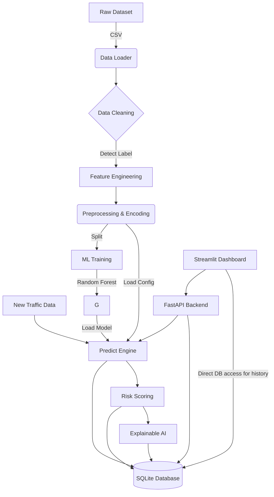

# Architecture

This document describes the high-level architecture of the MLCS-HACK-26 IoT Intrusion Detection System.

## Architecture Diagram

## Components

1.  **Data Loader (`src/data_loader.py`)**: Responsible for ingesting raw CSV/TSV data, detecting columns, and heuristically finding the target label if not explicitly configured.
2.  **Preprocessing (`src/preprocessing.py`)**: Handles data scaling (StandardScaler) and categorical encoding (LabelEncoder). Saves artefacts for later use during prediction.
3.  **Feature Engineering (`src/feature_engineering.py`)**: Derives advanced cybersecurity features like `bytes_per_packet` and `packets_per_second` if the required raw columns are present.
4.  **Model Training (`src/train.py`)**: Trains the configured ML models (Logistic Regression, Random Forest) and saves them using joblib.
5.  **Prediction Engine (`src/predict.py`)**: Loads saved models and preprocessing configs to evaluate new incoming data.
6.  **Risk Scoring (`src/risk_scoring.py`)**: Converts raw attack probabilities into a 0-100 risk score and categorises it into LOW, MEDIUM, HIGH, or CRITICAL.
7.  **Explainability (`src/explainability.py`)**: Uses SHAP (if available) or built-in feature importances to provide human-readable explanations for predictions.
8.  **API (`app/api.py`)**: A FastAPI application exposing endpoints for training, prediction, and retrieving metrics.
9.  **Dashboard (`app/dashboard.py`)**: A modern Streamlit application providing a SOC-like user interface for data exploration, model management, and interactive prediction analysis.
10. **Database (`src/database.py`)**: A lightweight SQLite database tracking all predictions and their assigned risk scores over time.
